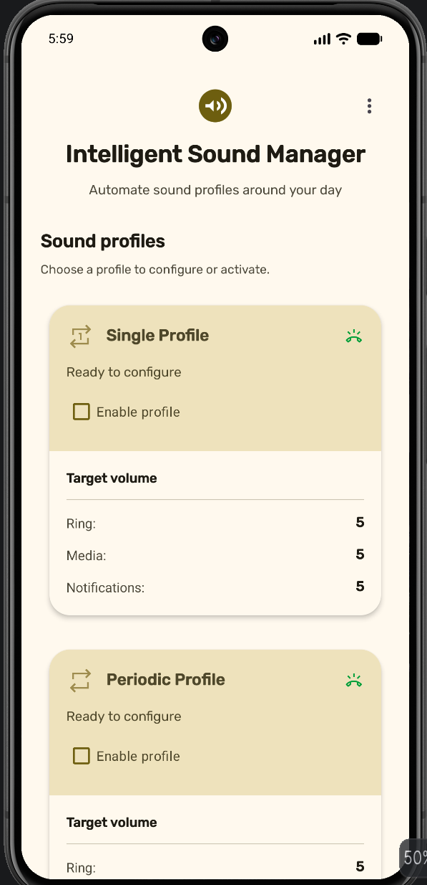
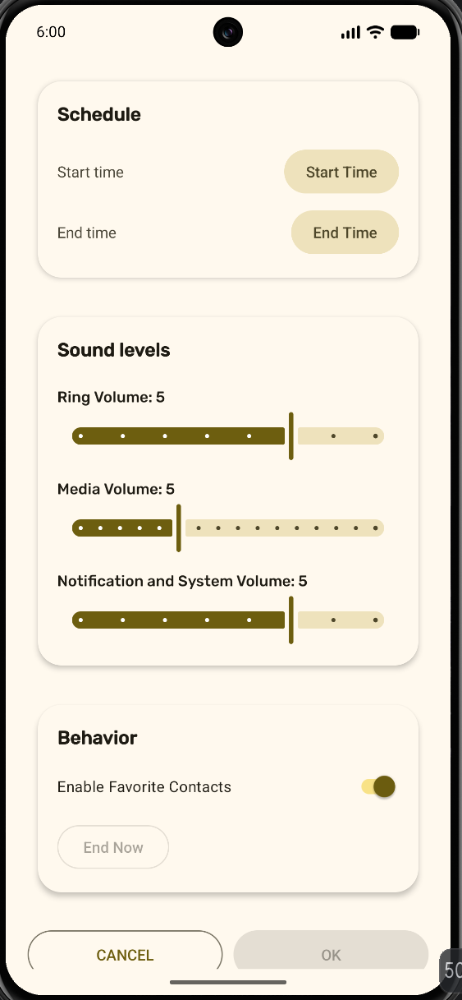
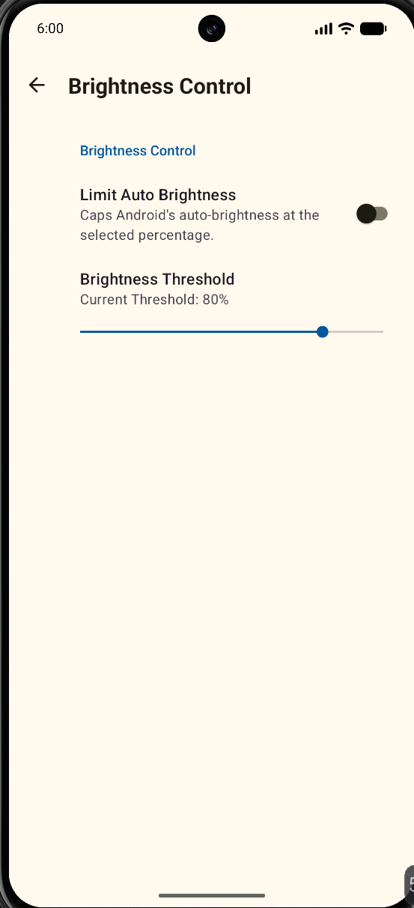
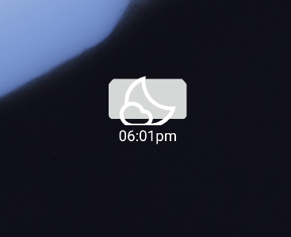
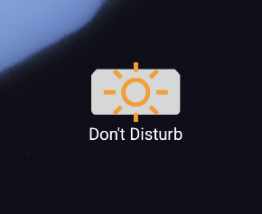

# Intelligent Sound Manager

An Android app that automatically switches your phone's volume (and optionally screen brightness) based on schedules you set, instead of you having to remember to do it yourself.

**Version 1.1.5**

## Why this exists

I got tired of manually silencing my phone before meetings/class and then forgetting to turn the ringer back on afterward. This app lets you set up "profiles" — a time window plus a target ringer/notification/media volume — and it handles the muting and restoring automatically in the background. There's also an optional ambient-light-based brightness cap for anyone who wants their screen to stop blasting them at full brightness in a dark room.

## What it actually does

- **Single profile** — mute (or set a custom volume) right now until a time you pick, then automatically restore your previous volume.
- **Periodic profile** — a recurring daily window (e.g. every weekday 9am–5pm) that applies automatically without you opening the app.
- **Favorite-contact override** — optionally let calls from your starred contacts still ring through at a low volume even while a profile is active, so you don't miss something important.
- **Brightness control** — reads the ambient light sensor and caps automatic brightness above a threshold you configure, using `WRITE_SETTINGS` to adjust the system brightness directly.
- **Home screen widget** — a one-tap toggle to start/stop the single profile without opening the app.
- **Survives reboots** — scheduled profiles are restored via a boot receiver, so a phone restart doesn't quietly cancel your schedule.
- **Debug screen** — a built-in screen that dumps all stored preferences and sensor state, mostly there so I didn't have to `adb shell dumpsys` everything while testing.

## Screenshots

| Main screen | Profile configuration |
| --- | --- |
|  |  |

| Brightness settings | Home screen widget |
| --- | --- |
|  |  |

The widget swaps between a plain sun icon when idle and a moon icon with the countdown time once a profile is active:

 

## How it's put together

The app is plain Java, no third-party backend — everything runs locally on-device.

- `MainActivity` — the home screen, shows profile cards and their current state.
- `ConfigPeriodActivity` — where you set times, volumes, and the favorites toggle for a profile.
- `SettingsActivity` — brightness feature toggle + threshold slider, built on AndroidX Preferences.
- `PeriodManager` — a `BroadcastReceiver` that does the actual work: applies/restores volumes, reschedules the next alarm, and handles boot recovery.
- `BrightnessControlService` — a foreground service that listens to the light sensor and adjusts screen brightness when enabled.
- `SinglePeriodManagerWidget` / `PopUpActivity` — the home screen widget and the small popup it launches when tapped.
- `Utils` — shared helpers for reading/writing preferences, talking to `AudioManager`, and formatting time.

Scheduling is done with `AlarmManager` exact alarms rather than `WorkManager`, since profile changes need to fire at a precise wall-clock time even if the phone is idle.

## Built with

Java · Android SDK (compileSdk/targetSdk 36, minSdk 26) · AndroidX (AppCompat, Preference, ConstraintLayout, CardView) · Material Components · Gradle

## Project layout

```text
Intelligent-Sound-Manager/
├── app/
│   └── src/
│       ├── main/
│       │   ├── java/com/ethanr/intelligentsoundmanager/
│       │   └── res/
│       ├── test/
│       └── androidTest/
├── docs/
│   ├── QA_REPORT.md
│   └── screenshots/
├── build.gradle
├── settings.gradle
└── gradlew / gradlew.bat
```

## Running it

1. Clone the repo and open it in Android Studio.
2. Let Gradle sync — it'll pull the Android SDK components it needs.
3. Run the `app` configuration on an emulator or a real device.

A few features only really make sense on a physical device — the light sensor for brightness control, actual phone calls for the favorites feature, and Do Not Disturb access. The emulator will run everything, but you won't see the brightness feature do much without a light sensor to feed it.

## Permissions

The app asks for a handful of permissions, all tied to a specific feature:

| Permission | Why |
| --- | --- |
| Do Not Disturb / notification policy access | Needed to change ringer volume/mode programmatically |
| Contacts, phone state, call log | Powers the favorite-contact override during calls |
| Modify system settings | Required to change screen brightness |
| Schedule exact alarms | Profiles need to fire at an exact time |
| Post notifications | Shows the ongoing brightness-service notification |
| Foreground service | Keeps the brightness monitor alive while active |

None of this data leaves the device — there's no analytics or network calls anywhere in the app.

## Testing

There's a manual QA checklist in `docs/QA_REPORT.md` that covers the scheduling, restoration, and permission flows I test through before tagging a release. A few basic unit/instrumentation tests are set up under `app/src/test` and `app/src/androidTest`, but most of the actual verification happens by hand on-device since a lot of this depends on real system behavior (alarms, sensors, audio state) that's awkward to mock convincingly.

## Known limitations

- Only one periodic profile is currently supported — the UI and storage were built with more in mind, but adding a second one still needs the "add profile" flow to be built out.
- Background execution restrictions on newer Android versions occasionally require the user to disable battery optimization for the app manually for alarms to stay reliable.
- No light/dark theme toggle yet — it currently follows the system theme only.

## License

No license file is included yet. If you want to reuse or build on this, reach out first.
